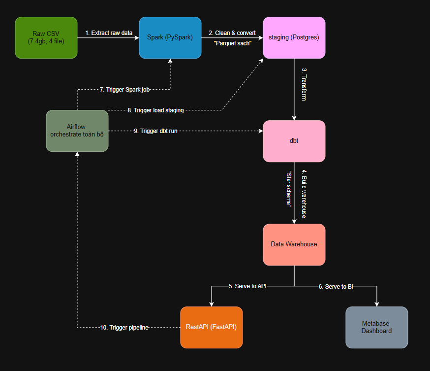

# NYC Taxi Data Pipeline

Dự án cá nhân xây dựng pipeline dữ liệu **end-to-end** (Extract → Load → Transform → Serve) cho dữ liệu NYC Yellow Taxi, từ file CSV thô đến dashboard phân tích — chạy hoàn toàn **local, miễn phí** bằng Docker.

## Kết quả

- **~22.3 triệu dòng** dữ liệu chuyến taxi (2 tháng, 2016-01 & 2016-02) nạp vào Data Warehouse dạng **star schema**
- **21.8 triệu dòng** sau khi làm sạch (lọc ~2.2% dữ liệu bẩn: GPS lỗi, giá âm, quãng đường bất thường...)
- **5 dashboard phân tích** trực quan trên Metabase: doanh thu theo giờ, xu hướng theo ngày trong tuần, phân bố hình thức thanh toán, tip theo vendor, ảnh hưởng giờ cao điểm

## Kiến trúc



Toàn bộ hạ tầng đóng gói bằng **Docker Compose**: PostgreSQL (data warehouse) + pgAdmin (quản trị DB) + Metabase (BI dashboard), mỗi service có volume riêng để dữ liệu/dashboard không mất khi restart.

## Tech stack

| Thành phần | Công nghệ |
|---|---|
| Nguồn dữ liệu | NYC Yellow Taxi Trip Data (Kaggle, gốc từ TLC), 2015-2016 |
| Data Warehouse | PostgreSQL 16 |
| ETL | Python (`psycopg2` — COPY streaming) + **dbt** (staging → intermediate → marts) |
| BI / Dashboard | Metabase |
| Quản trị DB | pgAdmin |
| Hạ tầng | Docker Compose |

## Bắt đầu nhanh

```bash
# 1. Clone repo, tải dataset (xem docs/dataset.md), giải nén vào raw_data/
# 2. Khởi động hạ tầng
docker compose up -d

# 3. Cài thư viện Python
pip install -r requirements.txt

# 4. Nạp dữ liệu thô vào staging
python load_staging.py

# 5. Transform + nạp star schema bằng dbt (cần Python 3.12 — xem dbt/README.md
#    nếu Python hệ thống là 3.14, dbt chưa hỗ trợ)
py -3.12 -m venv .venv-dbt
.venv-dbt\Scripts\Activate.ps1        # (Linux/macOS: source .venv-dbt/bin/activate)
pip install -r requirements.txt
dbt build --project-dir dbt --profiles-dir dbt

# 6. Mở Metabase, kết nối tới taxi_dwh, import các câu truy vấn trong sql/analytics/
```
→ Hướng dẫn chi tiết từng bước kèm ảnh chụp màn hình: [`docs/setup.md`](docs/setup.md)
→ Hướng dẫn riêng cho dbt (setup venv, lệnh chạy, lỗi thường gặp trên Windows): [`dbt/README.md`](dbt/README.md)

## Cấu trúc project

```
NYC-Taxi-Data-Pipeline/
├── docs/                  # Toàn bộ tài liệu (xem bảng bên dưới)
├── raw_data/              # Dữ liệu gốc (không đưa lên GitHub)
├── sql/
│   ├── 01_create_schema.sql   # Chỉ còn tạo schema + staging.yellow_trips
│   ├── archive/                # 02_transform_load.sql cũ — đã thay bằng dbt/
│   └── analytics/         # 5 câu truy vấn dựng dashboard
├── dbt/                   # staging → intermediate → marts (thay 02_transform_load.sql)
├── docker-compose.yml
├── load_staging.py
└── requirements.txt
```
→ Chi tiết đầy đủ: [`docs/project_structure.md`](docs/project_structure.md)

## Tài liệu

| File | Nội dung |
|---|---|
| [`docs/dataset.md`](docs/dataset.md) | Nguồn dữ liệu, cấu trúc cột gốc, quyết định phạm vi dữ liệu sử dụng |
| [`docs/pipeline.md`](docs/pipeline.md) | Chi tiết luồng ETL, lý do kỹ thuật từng giai đoạn, hướng mở rộng |
| [`docs/data_dictionary.md`](docs/data_dictionary.md) | Mô tả đầy đủ từng bảng, từng cột trong Data Warehouse |
| [`docs/setup.md`](docs/setup.md) | Hướng dẫn cài đặt và chạy pipeline từng bước, kèm ảnh minh họa |
| [`docs/notes.md`](docs/notes.md) | Kiến thức và bài học kỹ thuật rút ra trong quá trình xây dựng |
| [`docs/troubleshooting.md`](docs/troubleshooting.md) | Các lỗi thực tế đã gặp và cách xử lý (FK constraint, race condition, Docker volume...) |

## Điểm nhấn kỹ thuật

- **Xử lý file CSV lớn (3.5GB) hiệu quả**: dùng `COPY` streaming của PostgreSQL qua `psycopg2`, không load toàn bộ file vào RAM.
- **Data quality có kiểm soát**: 5 điều kiện lọc dữ liệu bẩn rõ ràng, có số liệu đối chiếu trước/sau (xem `docs/data_dictionary.md`).
- **Star schema chuẩn** với kỹ thuật *role-playing dimension* (`dim_date`/`dim_time` được dùng lại cho cả pickup và dropoff).
- **Hạ tầng persist đúng cách**: named volume cho cả 3 service, tránh mất dữ liệu/dashboard khi container restart.
- **Transform bằng dbt**: `staging → intermediate → marts`, `fact_trips` là **incremental model**, 38 test (not_null, unique, relationships, và 5 custom test tái hiện đúng 5 điều kiện lọc dữ liệu bẩn) — xem [`dbt/README.md`](dbt/README.md).

## Hướng phát triển tiếp theo
 
Nâng pipeline hiện tại thành nền tảng dữ liệu tự động, theo thứ tự **dbt → Spark → Airflow → REST API**:
 
| Công nghệ | Vai trò | Trạng thái |
|---|---|---|
| **dbt** | Thay `02_transform_load.sql` bằng models + tests, sinh lineage graph tự động | ✅ Hoàn tất |
| **Spark** | Xử lý phân tán toàn bộ 4 file gốc (~7.4GB) thay vì 2 file hiện tại, xuất Parquet sạch | ⏳ Tiếp theo |
| **Airflow** | Đóng gói pipeline thành 1 DAG chạy theo lịch, tự retry khi lỗi | ⏳ |
| **REST API** | Expose dữ liệu warehouse qua FastAPI, có thể trigger Airflow chạy thủ công | ⏳ |
 
→ Sơ đồ luồng chi tiết (10 luồng, có đánh số) và kế hoạch triển khai từng bước: [`docs/roadmap.md`](docs/roadmap.md)