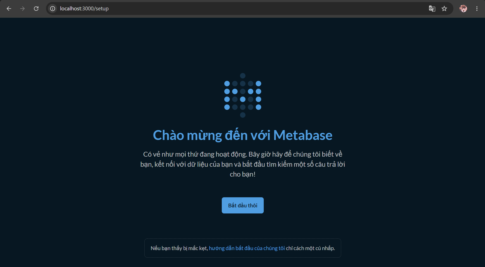
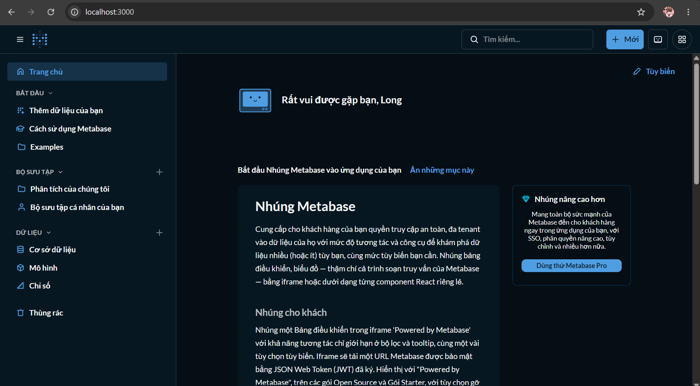
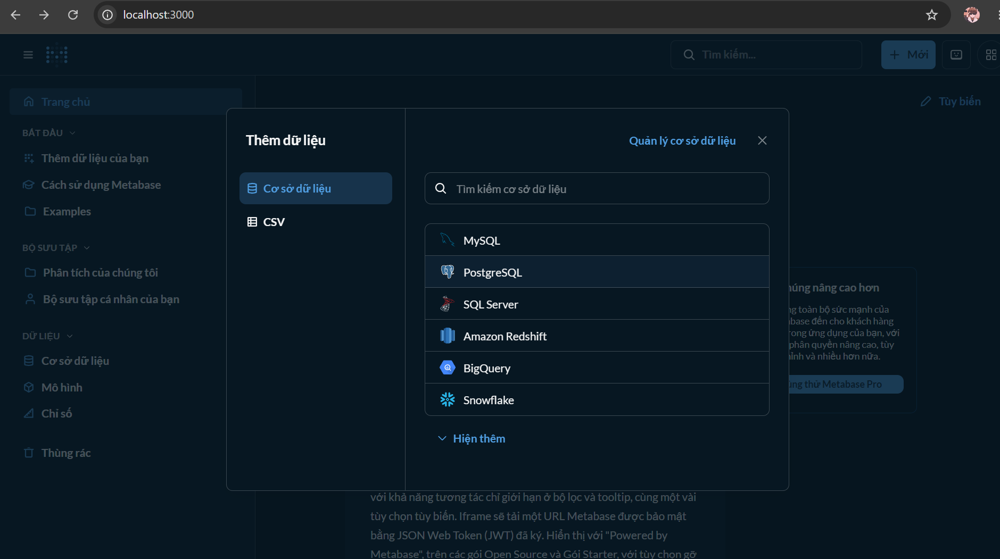
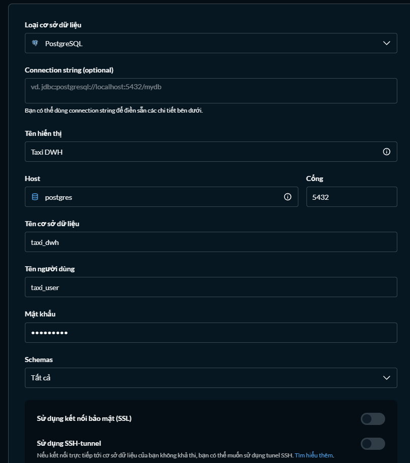
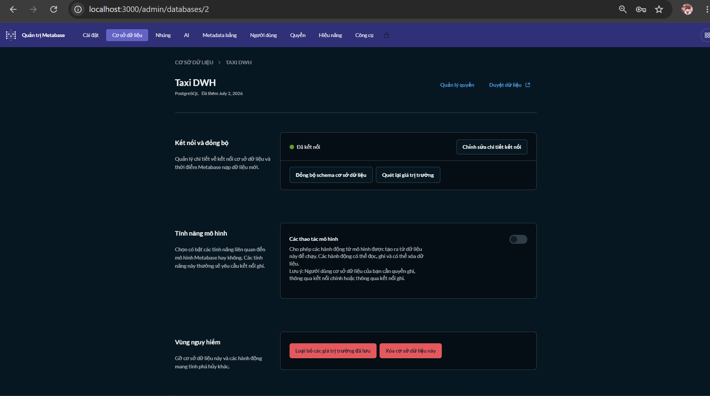
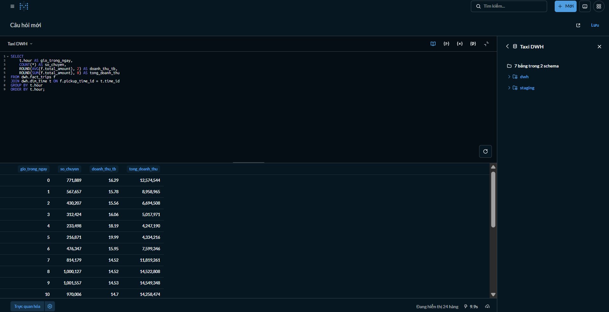
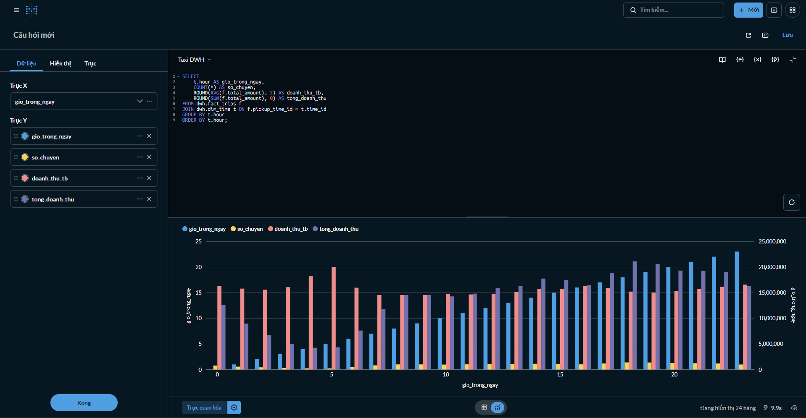
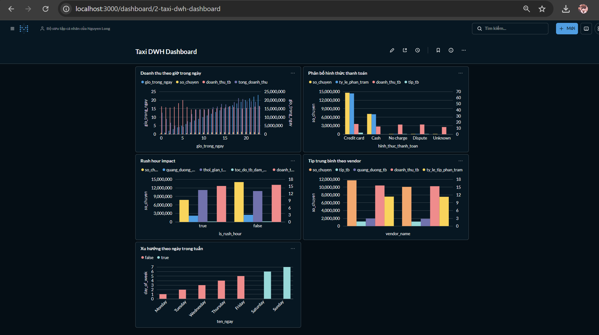

# Setup — Hướng dẫn thực hiện từng bước

## 1. Tải dataset từ Kaggle
https://www.kaggle.com/datasets/elemento/nyc-yellow-taxi-trip-data?resource=download

## 2. Giải nén và đặt tên `/raw_data`

## 3. Xem tên file và dung lượng từng file
```
cmd: dir raw_data
```
```
Directory of D:\Project\NYC-Taxi-Data-Pipeline\raw_data
07/01/2026  02:20 PM    <DIR>          .
07/01/2026  02:20 PM    <DIR>          ..
12/09/2021  07:31 AM     1,985,964,692 yellow_tripdata_2015-01.csv
12/09/2021  07:33 AM     1,708,674,492 yellow_tripdata_2016-01.csv
12/09/2021  07:36 AM     1,783,554,554 yellow_tripdata_2016-02.csv
12/09/2021  07:38 AM     1,914,669,757 yellow_tripdata_2016-03.csv
        4 File(s)  7,392,863,495 bytes
        2 Dir(s)  12,679,499,776 bytes free
```

## 4. Kiểm tra nhanh cấu trúc dữ liệu bằng Python (không cần load hết vào RAM)
```python
import pandas as pd

# chỉ đọc 5 dòng đầu để xem cột
df_sample = pd.read_csv("raw_data/yellow_tripdata_2015-01.csv", nrows=5)
print(df_sample.columns.tolist())
print(df_sample.dtypes)
print(df_sample.head())

# đếm số dòng thực tế mà không load hết (đọc theo chunk)
total_rows = sum(1 for _ in open("raw_data/yellow_tripdata_2015-01.csv"))
print(f"Tổng số dòng: {total_rows:,}")
```

Output xác nhận 19 cột, dùng tọa độ pickup/dropoff (xem chi tiết tại `dataset.md`):
```
PS D:\Project\NYC-Taxi-Data-Pipeline> python main.py
['VendorID', 'tpep_pickup_datetime', 'tpep_dropoff_datetime', 'passenger_count', 'trip_distance', 'pickup_longitude', 'pickup_latitude', 'RateCodeID', 'store_and_fwd_flag', 'dropoff_longitude', 'dropoff_latitude', 'payment_type', 'fare_amount', 'extra', 'mta_tax', 'tip_amount', 'tolls_amount', 'improvement_surcharge', 'total_amount']
...
[5 rows x 19 columns]
```

## 5. Tạo file `docker-compose.yml` và `sql/01_create_schema.sql`
Xem nội dung đầy đủ trong repo — 3 service: `postgres`, `pgadmin`, `metabase`, mỗi service có named volume riêng để persist dữ liệu qua các lần restart.

## 6. Khởi động Docker (cài Docker Desktop trước)
```powershell
docker compose up -d
```
```
PS D:\Project\NYC-Taxi-Data-Pipeline> docker compose up -d
[+] up 6/11
 ✔ Image dpage/pgadmin4                Pulled                                                                   5.1s
 ✔ Network nyctaxidatapipeline_default Created                                                                  0.1s
 ✔ Volume nyctaxidatapipeline_pgdata   Created                                                                  0.0s
 ✔ Container taxi_postgres             Started                                                                  1.0s
 ✔ Container taxi_metabase             Started                                                                  1.1s
 ✔ Container taxi_pgadmin              Started                                                                  1.1s
```

## 7. Đặt `load_staging.py` vào thư mục gốc project
Ngang hàng với `raw_data/` và `docker-compose.yml`.

## 8. Cài thư viện
```powershell
pip install psycopg2-binary
```

## 9. Chạy nạp dữ liệu vào staging
```powershell
python load_staging.py
```
```
→ Đang nạp yellow_tripdata_2016-01.csv (1.71 GB)...
  Xong trong 130.2 giây.
→ Đang nạp yellow_tripdata_2016-02.csv (1.78 GB)...
  Xong trong 135.6 giây.

Tổng số dòng trong staging.yellow_trips: 22,288,907
```

## 10. Tạo `sql/02_transform_load.sql`
Sinh `dim_date`, `dim_time`, transform và nạp `fact_trips` kèm làm sạch dữ liệu (5 điều kiện lọc — xem `notes.md`).

⚠️ **Lưu ý quan trọng:** script này TRUNCATE cả 3 bảng `fact_trips`, `dim_date`, `dim_time` trong **cùng 1 câu lệnh** để tránh lỗi FK constraint. Xem giải thích chi tiết tại `troubleshooting.md`.

## 11. Chạy script transform (chỉ 1 terminal, không chạy song song lệnh ghi khác)
```powershell
Get-Content sql/02_transform_load.sql | docker exec -i taxi_postgres psql -U taxi_user -d taxi_dwh
```
> PowerShell không hỗ trợ redirect `<` — bắt buộc dùng `Get-Content | pipe` như trên.

Kết quả cuối cùng:
```
PS D:\Project\NYC-Taxi-Data-Pipeline> Get-Content sql/02_transform_load.sql | docker exec -i taxi_postgres psql -U taxi_user -d taxi_dwh
TRUNCATE TABLE
INSERT 0 506
INSERT 0 1440
INSERT 0 21792952
      table_name      | row_count 
----------------------+-----------
 dwh.dim_date         |       506
 dwh.dim_time         |      1440
 dwh.fact_trips       |  21792952
 staging.yellow_trips |  22288907
(4 rows)
```

## 12. (Tùy chọn) Theo dõi tiến độ từ cửa sổ terminal khác
An toàn để chạy song song vì đây là câu lệnh chỉ đọc (`SELECT`):
```powershell
docker exec -i taxi_postgres psql -U taxi_user -d taxi_dwh -c "SELECT pid, state, now() - query_start AS running_time, LEFT(query, 60) AS query_preview FROM pg_stat_activity WHERE state = 'active' AND query NOT ILIKE '%pg_stat_activity%';"
```

## 13. Setup Metabase
Truy cập `http://localhost:3000` → làm theo wizard tạo tài khoản admin đầu tiên (email/password tùy bạn, chỉ dùng local).



Sau khi tạo tài khoản thành công:



Thêm dữ liệu → chọn PostgreSQL:



Cấu hình kết nối:
- Database type: `PostgreSQL`
- Host: `postgres` *(dùng tên service trong docker-compose, không phải `localhost`, vì Metabase gọi qua network nội bộ Docker)*
- Port: `5432`
- Database name: `taxi_dwh`
- Username: `taxi_user` / Password: `taxi_pass`



Kết nối thành công — trạng thái "Đã kết nối" (chấm xanh) xác nhận Metabase đã thấy được `taxi_dwh`:



## 14. Tạo Question SQL và Dashboard

- Quay về trang chủ (`http://localhost:3000`) → chọn **"Mới"** góc phải → chọn **"Truy vấn SQL"** → chọn database **Taxi DWH** → chạy lệnh SQL (nội dung lấy từ `sql/analytics/`):



- Bấm nút **"Trực quan hóa"** (góc dưới trái, cạnh biểu tượng bánh răng) → chọn loại biểu đồ Cột/Đường → vào **Cài đặt** chỉnh trục X, và **chỉ giữ 1 metric chính mỗi chart** (tránh nhiều trục Y gây rối — xem `troubleshooting.md`):



- Bấm **Lưu**, đặt tên câu hỏi (ví dụ: "Doanh thu theo giờ trong ngày"), chọn bộ sưu tập — lặp lại cho cả 5 câu hỏi trong `sql/analytics/`.

- Tạo Dashboard: quay về trang chủ → **"Mới"** → **"Bảng điều khiển"** → đặt tên → thêm lần lượt cả 5 câu hỏi đã lưu vào dashboard → **Lưu**.

